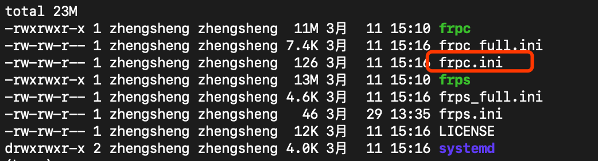

# 分享一个使用VPN连接实验室自己机器的方法

## TeamViewer的缺点

* 卡顿
* 限制连接时长
* 机器重启后不能自动打开
* 无法在直接在本地远程编码和调试

## 内网穿透并配置自动启动

之前实验室申请了VPN可以直接连接123和124服务器，所以可以利用123或者124作为中转实现内网穿透，连接811自己的机器。前提是：能正常使用VPN连接123或124。

### 准备工作

* 实行内网穿透用到的是frp，下载地址<https://github.com/fatedier/frp/releases>
，下载相应版本到服务器（123或124）和自己实验室的机器上。


### 服务器配置

（这一步我在123和124都已经配置过，可以跳过。如果自己想重新配置，注意使用的端口号不要重复。我使用的端口号是7000）

* 解压下载的文件，编辑文件`frps.ini`


```
[common]
bind_port = 7000  # 客户端连接服务器的端口，如果自己配置，注意不要重复
token = sDesQJk@KlO  # 客户端连接服务器端的口令
```

* 配置完之后运行

`
./frps -c frps.ini
`

### 客户端配置

这一步在自己实验室的机器上操作

* 解压下载的文件，编辑文件`frpc.ini`


```
[common]
server_addr = 172.18.30.124  # 服务器ip
server_port = 7000  # 上一步服务器配置的端口号
token=sDesQJk@KlO  # 上一步配置的客户端连接服务器端的口令

[ssh] # 注意ssh可能是有重复，如果有重复改成ssh1，ssh2，ssh3...
type = tcp
local_ip = 127.0.0.1
local_port = 22  # 穿透的本地端口
remote_port = 6002  # 暴露在外网的端口
```

* 配置完之后运行

`
./frpc -c frpc.ini
`

### 愉快地连接

* 服务器和客户端启动后就可以在本地使用ssh愉快地连接了811自己的机器了，可以用pycharm或vscode愉快地在本地远程编码和调试了

```
# 注意端口是上一步客户端暴露在外网的端口，用户名不是123或124的用户名，是811自己机器的用户名，ip地址是123或124，密码也是811自己机器的密码
ssh -p 6002 zs@172.18.30.124
```

## 配置自动启动

配置自动启动后就不用担心机器重启后连不上了，不用麻烦别人帮你打开了

### 配置服务器自动启动

（这一步我在服务器配置过了，如果想自己配置，参考下面客户端的配置）

### 配置客户端自动启动

* 编辑`/lib/systemd/system/frpc.service`

`
sudo vim /lib/systemd/system/frpc.service
`

```
[Unit]
Description=frpc service
After=network.target network-online.target syslog.target
Wants=network.target network-online.target

[Service]
Type=simple

# 启动服务的命令（注意替换成你的frpc实际安装目录）
ExecStart=/home/zs/app/frp_0.32.0_linux_amd64/frpc -c /home/zs/app/frp_0.32.0_linux_amd64/frpc.ini

[Install]
WantedBy=multi-user.target
```

* 启动（重启、停止）frpc。（注意先停掉刚才`./frpc -c frpc.ini`启动的服务）

`
sudo systemctl start frpc
`

`
sudo systemctl restart frpc
`

`
sudo systemctl stop frpc
`

* 打开自启动

`
sudo systemctl enable frpc
`
